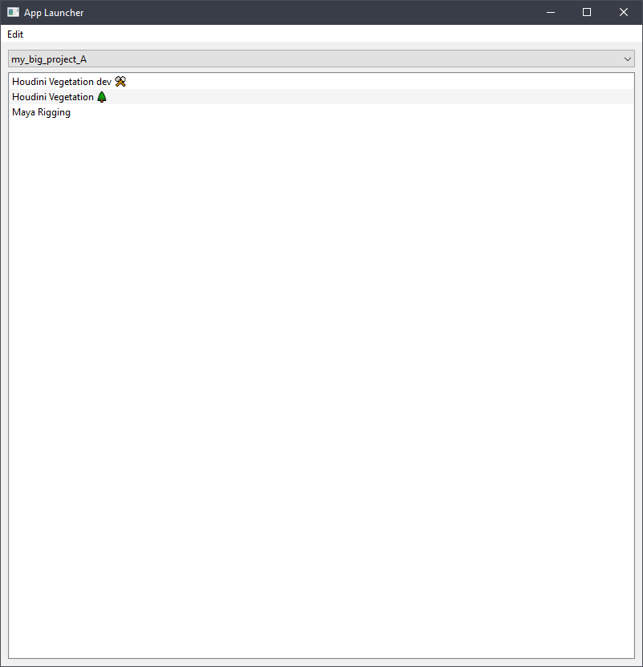
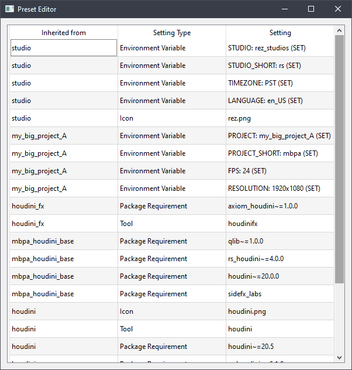
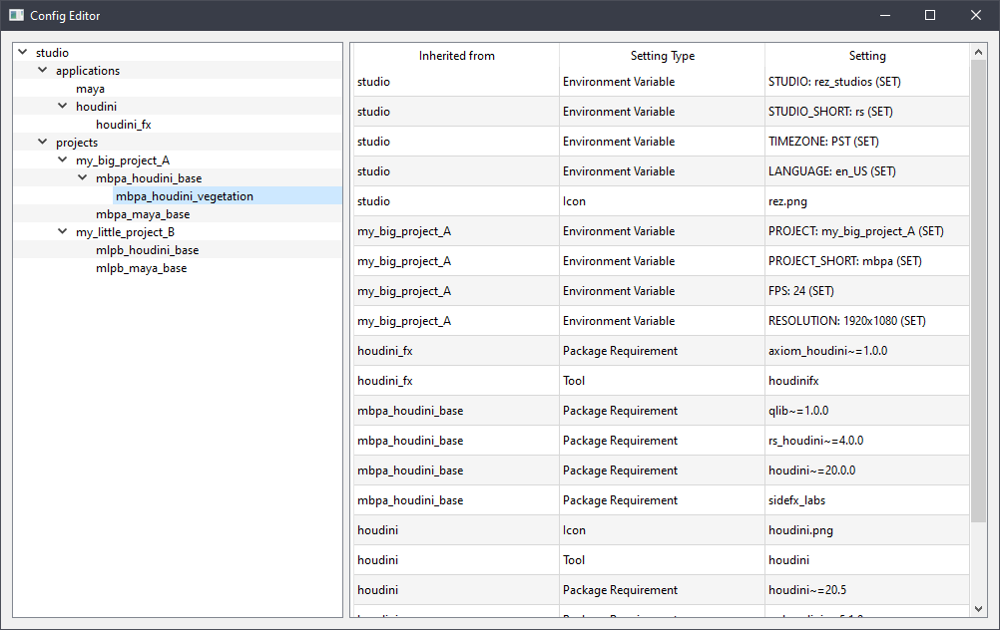

## Rez layered config management + Launcher demo

This is a demo project to demonstrate how one could structure a launcher & config system on top of rez.

The data model below is somewhat rebuilt in `src/rez_wg_config_launcher_demo/data_model.py`


### Install & run

git clone then
```
pip install .
python -m rez_wg_config_launcher_demo
```

### UIs




